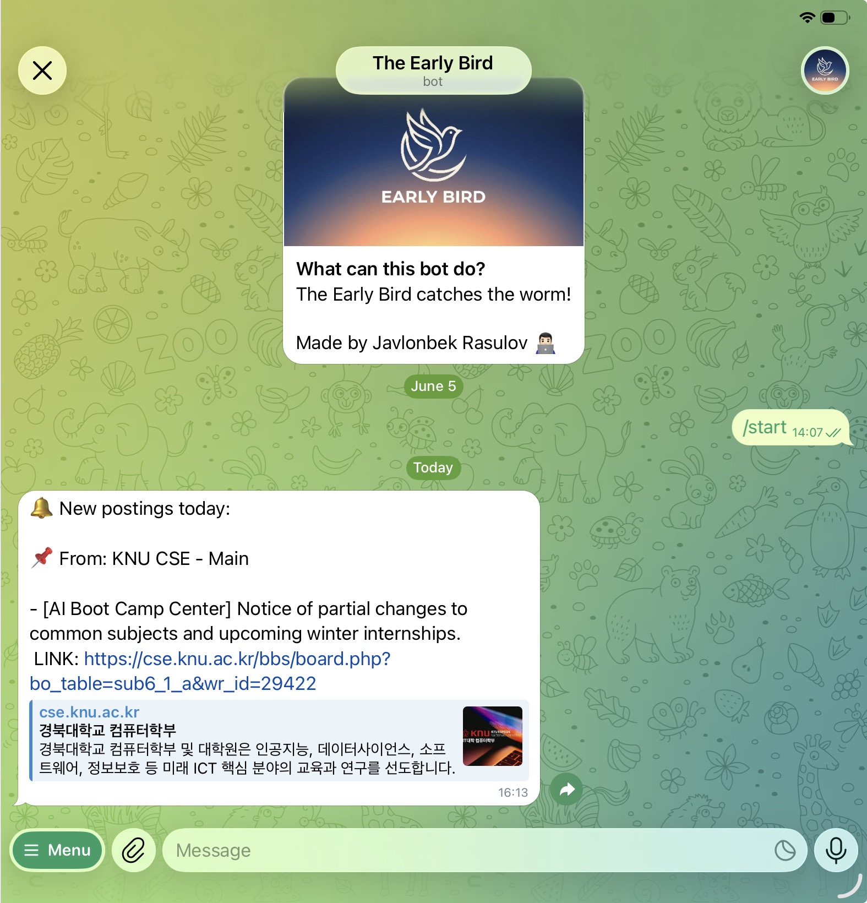

<p align="center">
  
</p>
Tired of missing internships, events and other programs because you forgot to check the announcement website everyday?

Meet the Early Bird: A free script that checks the university/organisation websites for you and sends you which new opportunities were announced today (including AI summarization, translation and the link to the announcement).

## How it works

1. A GitHub Actions workflow runs once a day (you set the time)
2. It fetches each site listed in `sites.json` and parses out post titles, links, and dates
3. It compares against what it saw last time (stored in `watcher.db`) to find what's new
4. New posts get summarized & translated to English (optional) and sent to you in one Telegram message
5. If nothing's new, you still get a short "no new posts today" message, so you can sleep knowing you didn't miss anything

## Setup

### 1. Fork or clone this repo

Make it your own because you'll need to push your own changes (secrets, your site list) to it.

### 2. Create your own Telegram bot

1. Message [@BotFather](https://t.me/BotFather) on Telegram, send `/newbot`, follow the prompts
2. Save the bot token it gives to you
3. In Telegram, send any message to your new bot
4. Visit `https://api.telegram.org/bot<YOUR_BOT_TOKEN>/getUpdates` in a browser to get your chat ID. it is the number in `"chat":{"id": ...}`

### 3. (Optional) Get a free Gemini API key

Only needed if you want non-Korean (or non-original-language) titles translated to English. Get a free key at [aistudio.google.com/apikey](https://aistudio.google.com/apikey).

If you skip this, the message just shows titles in their original language, everything else still work same.

### 4. Add your secrets to GitHub

Repo -> Settings -> Secrets and variables -> Actions -> New repository secret. Add:

| Secret name | Value |
|---|---|
| `TELEGRAM_BOT_TOKEN` | Taken from BotFather |
| `TELEGRAM_CHAT_ID` | Your chat ID |
| `GEMINI_API_KEY` | Your Gemini key, if using translation |
| `MY_PROXY_URL` | See step 5 below |

### 5. (Only if your target site blocks it) Set up your own proxy

Some university/government sites block requests coming from GitHub Actions' servers. If you can open the website with your browser but see fail in test run logs you should do this part as well.

The fix is a free Cloudflare Worker that fetches on your behalf from a different set of servers:

1. Sign up free at [dash.cloudflare.com](https://dash.cloudflare.com)
2. Workers & Pages -> Create -> Create Worker -> give it a name -> Deploy
3. Click **Edit code**, replace everything with the contents of `cloudflare-worker.js` in this repo
4. Deploy again
5. You'll get a URL like `https://your-worker-name.your-subdomain.workers.dev`
6. Add it as the `MY_PROXY_URL` secret, formatted as: `https://your-worker-name.your-subdomain.workers.dev/?url=`
7. In `sites.json`, set `"use_proxy": true` for any site that failed before

If your target sites fetch fine without this, skip it entirely and leave `use_proxy` set to `false`

### 6. Set up reliable daily timing

Since GitHub's built-in `schedule` trigger for Actions can run hours late for newly created workflows, we use a free external scheduler instead:

1. Sign up free at [cron-job.org](https://cron-job.org)
2. Create a fine-grained GitHub Personal Access Token: GitHub Settings -> Developer settings -> Personal access tokens -> Fine-grained tokens -> select this repo -> Permissions -> Actions -> Read and write
3. In cron-job.org, create a cronjob:
   - URL: `https://api.github.com/repos/<your-username>/<your-repo>/actions/workflows/check.yml/dispatches`
   - Method: `POST`
   - Headers: `Authorization: Bearer <your-token>`, `Accept: application/vnd.github+json`, `Content-Type: application/json`
   - Body: `{"ref":"main"}`
   - Schedule: choose the time you want, in your own timezone

### 7. Test it

Your repo's actions tab -> "Check new posts" -> Run workflow. Check the logs. First run on a new site always says "first run, baseline set to..." and sends no digest for that site -- this is expected, it just establishes a starting point.

## Adding a website to monitor

No coding needed. Copy the prompt below, put your website URL in the blank, and send it to an AI assistant (ChatGPT, Claude, etc.)

```
I'm adding a site to a Python web scraper. It reads a sites.json file where each entry looks like this:

{
  "name": "Display name for this site",
  "url": "https://the-actual-board-page-url",
  "row_selector": "CSS selector matching each post row",
  "title_selector": "CSS selector for the title link, relative to a row",
  "date_selector": "CSS selector for the date, relative to a row (optional -- omit if the date column has no reliable class/position)",
  "date_format": "Python strptime format matching the site's date text, e.g. %Y-%m-%d or %Y/%m/%d",
  "base_url": "used to resolve relative links to full URLs",
  "use_proxy": true or false
}

If date_selector is omitted, the scraper scans every cell in the row and uses the first one matching date_format.

The site I want to add is: [Paste the website URL here]

Try fetching the page yourself and find one post row's HTML to work from. If you can't access it, tell me exactly how to get it: which element to right-click, what to click in dev tools, and what to copy back to you.

Write the complete sites.json entry, matching the format above exactly.
```

Paste the code you get into `sites.json`, run a test (see setup step 7), and check the logs.

## Limitations

- Works best on table/board-style layouts. Sites with card-grid layouts usually don't have a clear "posted date," so they need different handling which is not supported yet.
- If a site's HTML changes , its config may stop working and need updating.
- Built for checking a handful of sites once a day using free tools, not heavy or frequent scraping which might require more resources.